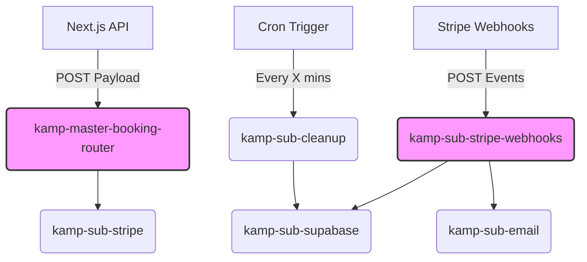

# n8n Modular Workflow Architecture Plan

## 1. Goal

Design and generate a production-ready, modular n8n project that acts as the orchestration layer for Kamp Lambingan's booking and payment systems. The workflows will be heavily decoupled using a microservices-style "Execute Workflow" architecture.

## 2. Clarification on `create_pending_booking`

In our previous discussion, we agreed to shift `create_pending_booking` to **Next.js** to guarantee the slot is locked before Stripe checkout creation, preventing ghost bookings if n8n crashes. 

Because Next.js now executes this RPC and sends the `booking_id` in the webhook payload, **n8n no longer needs to call `create_pending_booking`**. 

I will adjust `kamp-sub-booking.json` to act as a general-purpose booking utility workflow (e.g., retrieving booking details if needed) rather than creating the booking, ensuring it aligns perfectly with your Next.js gateway design.

## 3. Workflow Dependency Diagram

## 4. Workflows to Generate

I will generate 6 importable JSON files (since `kamp-sub-booking` is mostly bypassed by Next.js, but I will include it as a read-only utility if you'd like, or we can omit it. I will provide it as requested but adapted).

1. **`kamp-sub-supabase.json`**: Contains a Switch node to route to different Supabase RPC executions (`confirm_booking`, `expire_booking`, `cancel_booking`).
2. **`kamp-sub-email.json`**: Uses the Send Email node (SMTP) or an HTTP node (e.g., Resend/SendGrid) to fire templated emails based on status.
3. **`kamp-sub-stripe.json`**: Makes an HTTP Request to the Stripe API (`/v1/checkout/sessions`) to generate the payment URL with the required metadata.
4. **`kamp-sub-stripe-webhooks.json`**: Receives Stripe events. Uses a Switch node for `checkout.session.completed`, `checkout.session.expired`, and `payment_intent.payment_failed`. Calls `kamp-sub-supabase` and `kamp-sub-email`.
5. **`kamp-sub-cleanup.json`**: A Cron node that triggers a Supabase RPC to clean up expired bookings.
6. **`kamp-master-booking-router.json`**: The main webhook (`/booking-checkout`). Receives the Next.js payload, calls `kamp-sub-stripe` to get the URL, and responds synchronously using a "Respond to Webhook" node.

## 5. Implementation Approach

I will create a new directory `n8n-workflows/` in your workspace and generate the 6 JSON files there.

**Crucial Note on n8n Imports**:
When you use "Execute Workflow" nodes in n8n, they link to other workflows via an internal ID. Because these workflows don't exist in your instance yet, I will generate them with placeholder IDs (or use the "Call by Name" feature if available, but "Call by ID" is standard). After importing, you will need to manually open the "Execute Workflow" nodes and select the newly imported sub-workflows.

## User Review Required

1. **Email Node**: Do you want the `kamp-sub-email` workflow to use standard SMTP, or an HTTP request to an API like Resend, SendGrid, or Postmark?
2. **Supabase Node**: Should `kamp-sub-supabase` use the native n8n Supabase node, or generic HTTP Request nodes pointing to your Supabase REST API? (The generic HTTP node is sometimes preferred for RPCs as the native node can be finicky with custom RPCs).
3. Do you approve of omitting `create_pending_booking` from n8n to honor our Next.js orchestration rule?

Once approved, I'll generate the JSON files in a dedicated folder!
